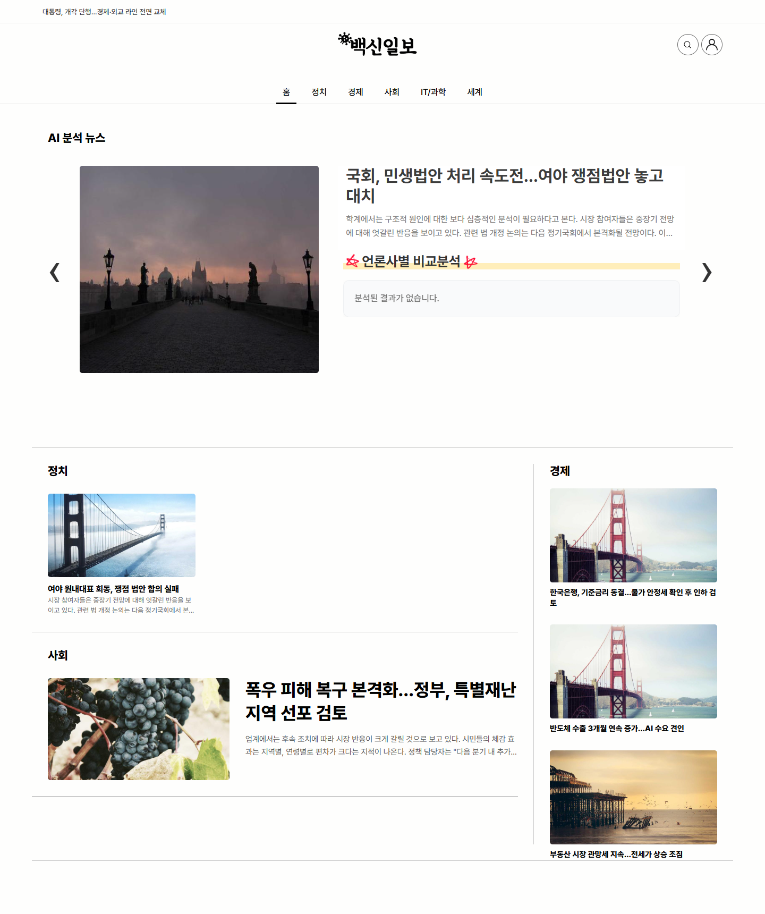
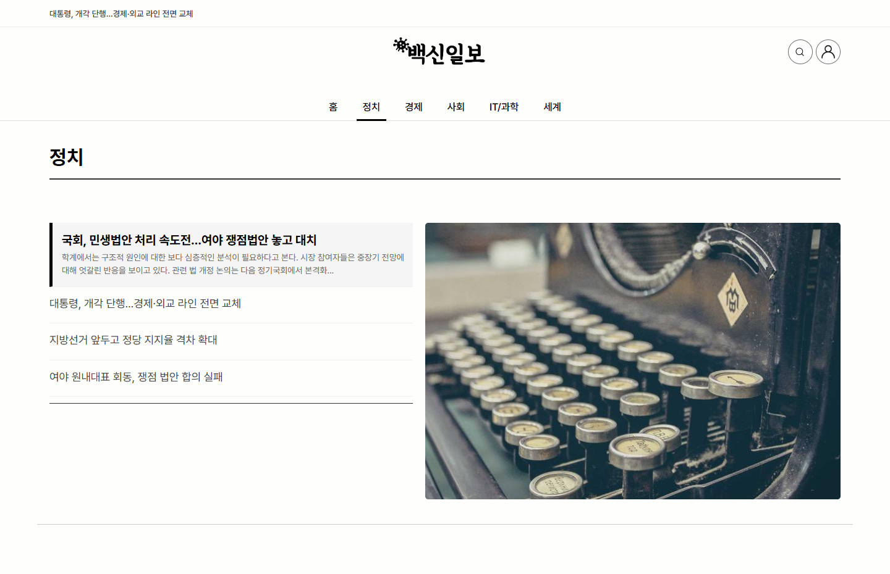
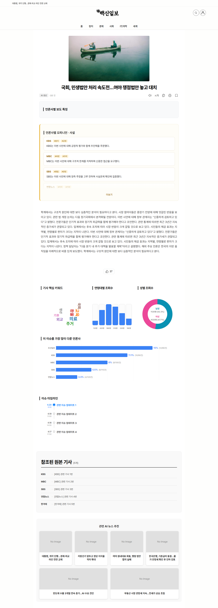
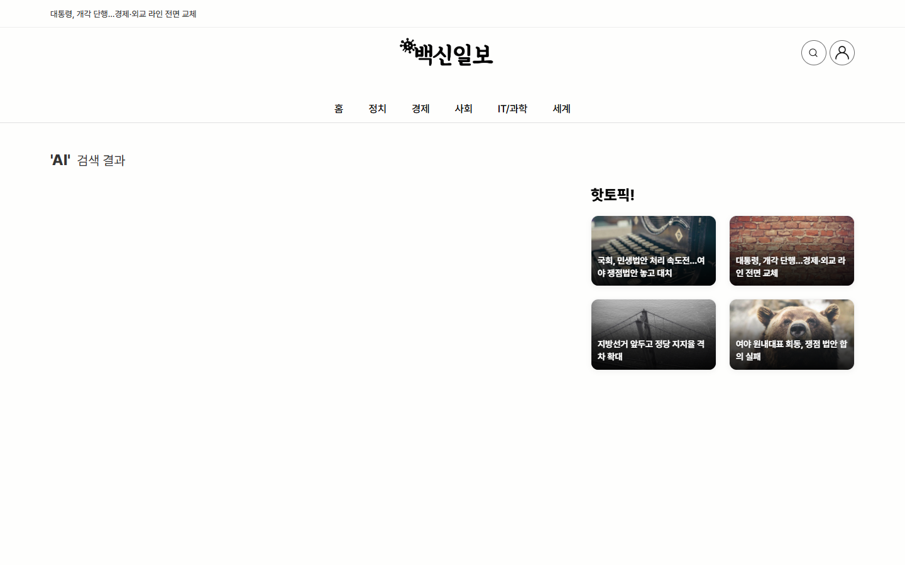

# 백신일보 (vaccine-daily)

> AI가 10개 언론사의 뉴스를 실시간으로 크롤링하고, 클러스터링 및 분석하여 리포트를 자동 생성하는 뉴스 인텔리전스 플랫폼

## 핵심 기능 (Key Features)

### 1. 멀티 에이전트 리포트 생성 — Writer · Editor · Reviewer
동일 이슈에 대해 복수 언론사 기사를 하나의 리포트로 합성하는 **3단계 에이전트 파이프라인**입니다.
- **Writer (작성자)** — 클러스터링된 관련 기사들을 입력받아 중립적 톤의 초안 리포트를 생성합니다.
- **Reviewer / Critic (검토자)** — 초안과 원문을 대조하여 **환각(hallucination) 여부와 사실 왜곡**을 탐지하고 `PASS / FAIL` 판정을 내립니다.
- **Editor (편집자)** — Reviewer의 피드백을 반영해 문장을 다듬고 인용 표기와 구조를 정리합니다.
- 실패 시 자동 재시도(retry) 및 **비동기 병렬 처리**(최대 5건 동시 생성)로 처리량을 확보합니다.
- 구현: [backend/ai_agentic_generator.py](backend/ai_agentic_generator.py)

### 2. RAG · Knowledge Graph · 임베딩 캐시로 LLM API 비용 절감
불필요한 LLM 호출을 줄이기 위해 **검색 기반 증강(RAG)** 과 **지식 그래프(KG)**, **벡터 DB 캐시** 를 조합했습니다.
- **ChromaDB 임베딩 캐시** — 기사 임베딩을 재사용하여 중복 인코딩과 중복 LLM 호출을 회피합니다. 클러스터링 시 캐시 히트율이 높을수록 파이프라인 비용이 선형으로 감소합니다.
- **GraphRAG (Entity-Relation-Entity 트리플)** — 각 기사에서 `주체 · 관계 · 대상` 트리플을 추출해 **지식 그래프**를 구축합니다. 동일 사건에 대한 **언론사별 논조·프레이밍 차이**를 정량화하고, 비교 분석 프롬프트에는 **그래프 요약만** 주입해 컨텍스트 길이를 크게 줄입니다.
- **2단계 검증 (Morphological + LLM)** — Kiwi 형태소 분석으로 1차 필터링 후, 통과한 후보에 한해서만 LLM(GPT-4o-mini) 확인을 호출합니다. 대부분의 명백한 케이스가 룰 기반에서 걸러져 **LLM 호출 수가 수 배 감소**합니다.
- **경량 모델 채택** — 리포트 생성은 `gpt-4o-mini`, 한국어 임베딩은 오픈소스 `ko-sroberta`로 통일하여 이슈당 비용을 수 센트대로 유지합니다.

### 3. 자동화된 뉴스 수집 · 클러스터링 파이프라인
- 조선, KBS, MBC, SBS, 연합, 한겨레, 중앙, 경향, 한국, JTBC 등 **10개 언론사**를 **5분 주기**로 크롤링
- **HDBSCAN + ko-sroberta 임베딩**으로 관련 기사를 자동 클러스터링
- 클러스터 단위로 리포트 생성·갱신 → 동일 이슈 중복 생성 방지

### 4. 개인화 추천 · 키워드 분석
- 구독 키워드, 열람 이력, 카테고리 선호도 기반 **다기준 스코어링**으로 재정렬 (메인 피드 상위 3건은 캐러셀 유지, 이후 개인화 적용)
- **TextRank + KR-WordRank 앙상블**로 기사 핵심 키워드 추출, D3 워드클라우드로 시각화

### 5. 사실 검증 · 대시보드 · 접근성
- **인용 검증**: 본문 문장 임베딩과 원문 기사 문장 임베딩 간 코사인 유사도로 원 출처를 자동 매칭
- 독자 **인구통계·언론사 보도량 분석 대시보드** (Recharts)
- **Web Speech API 기반 TTS** (음성·속도 조절), 데스크톱/모바일 **반응형 UI**

### 🌐 라이브 데모: **https://jeonhs9110.github.io/vaccine-daily/**

> 라이브 데모는 GitHub Pages에 호스팅된 **정적 프론트엔드 빌드**입니다.
> 백엔드(크롤러·클러스터링·LLM 파이프라인)는 실행되지 않으며, 모든 API 응답은
> 브라우저 내 목(mock) 어댑터가 결정론적인 한국어 더미 데이터로 대체합니다.
> 전체 스택을 실행하려면 아래 "시작하기" 섹션을 참고하세요.

## 스크린샷

| 메인 | 카테고리 (정치) |
|------|------------------|
|  |  |

| 기사 상세 (오피니언·차트·타임라인·비교) | 검색 결과 |
|------------------------------------------|-----------|
|  |  |

PPT 링크: https://docs.google.com/presentation/d/1n3qlZx-QcmbCtOfVL4Ss_9rwqnxXG-3z/edit?usp=sharing&ouid=101202909226412214966&rtpof=true&sd=true

## 시연 영상 (아래 이미지를 클릭하여 재생하세요)
[](https://youtu.be/MtE-sdo6wY0)

## 기술 스택

| 영역 | 기술 |
|------|------|
| Frontend | React 18, React Router 6, Recharts, D3 Cloud |
| Backend | FastAPI, SQLAlchemy, AsyncIO |
| Database | PostgreSQL 15, ChromaDB (벡터 DB) |
| AI / NLP | OpenAI GPT-4o-mini, SentenceTransformers (ko-sroberta), HDBSCAN, Kiwi, KR-WordRank |
| Infra | Docker Compose, Nginx, Certbot (HTTPS), AWS EC2 |

## 아키텍처

```
크롤러 (5분 주기)
  │
  ▼
[10개 언론사] ──▶ PostgreSQL (기사 저장)
                       │
                       ▼
              HDBSCAN 클러스터링 ◄──── ChromaDB (임베딩 캐시)
                       │
                       ▼
              2단계 검증 (형태소 + LLM)
                       │
                       ▼
              AI 리포트 생성 (Writer → Critic → Editor)
                       │
                       ▼
              GraphRAG 비교 분석
                       │
                       ▼
              FastAPI ──────────▶ React (사용자 화면)
```

## 시작하기

### 사전 요구사항

- Docker & Docker Compose
- OpenAI API Key

### 1. 클론 및 환경변수 설정

```bash
git clone https://github.com/JunePark2018/VaccineDailyReport.git
cd VaccineDailyReport

cp .env.example .env
# .env 파일을 열어 아래 값들을 수정
#   POSTGRES_USER / POSTGRES_PASSWORD / POSTGRES_DB
#   OPENAI_API_KEY
#   SERVER_IP (배포 서버 IP)
```

### 2. Docker Compose로 실행

```bash
# 전체 서비스 빌드 및 실행
docker compose up -d --build

# 로그 확인
docker compose logs -f backend
```

서비스가 시작되면:
- **프론트엔드**: http://localhost (80)
- **백엔드 API**: http://localhost:8081
- **API 문서**: http://localhost:8081/docs

### 3. 로컬 개발 (Docker 없이)

```bash
# 백엔드
cd backend
python -m venv venv
source venv/bin/activate  # Windows: venv\Scripts\activate
pip install -r requirements.txt
uvicorn main:app --reload

# 프론트엔드
cd frontend
npm install
npm start
```

## 프로젝트 구조

```
VaccineDailyReport/
├── backend/
│   ├── main.py                  # FastAPI 앱 & 백그라운드 워커
│   ├── scraper.py               # 뉴스 크롤러 (10개 언론사)
│   ├── clustering.py            # HDBSCAN 클러스터링 엔진
│   ├── ai_processor.py          # AI 리포트 생성 파이프라인
│   ├── ai_agentic_generator.py  # Writer-Critic-Editor 에이전트
│   ├── ai_graph_comparer.py     # GraphRAG 비교 분석
│   ├── keyword_extractor.py     # TextRank + KR-WordRank 키워드 추출
│   ├── routers/                 # API 엔드포인트
│   │   ├── ai_news.py           #   리포트 CRUD, 인용 검증, 타임라인
│   │   ├── users.py             #   회원, 구독, 스크랩
│   │   ├── search.py            #   검색
│   │   └── statistics.py        #   독자 통계, 언론사 분석
│   └── database/
│       ├── models.py            # SQLAlchemy 모델
│       ├── crud.py              # DB 조작
│       └── engine.py            # DB 연결 설정
├── frontend/
│   ├── src/
│   │   ├── pages/               # 페이지 컴포넌트 (Main, Article, 카테고리별)
│   │   ├── components/          # 공통 컴포넌트 (Header, SearchBar 등)
│   │   ├── utils/               # 유틸리티 (날짜 포맷 등)
│   │   └── App.js               # 라우팅
│   └── public/
├── docker-compose.yml
└── .env.example
```
